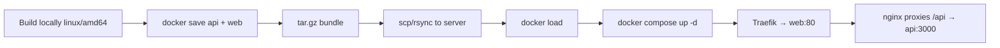

# Deployment (remote Linux server)

Deploy Timefairy to a remote Linux host **without a container registry** (no Docker Hub). Build images locally, ship them as a tarball, load on the server, and run with Docker Compose behind an existing **Traefik** reverse proxy.

## Overview



| Component | Image source |
|-----------|--------------|
| `postgres` | Pulled on server (`postgres:16-alpine`, public) |
| `api`, `web` | Built locally, shipped via `docker save` / `docker load` |

API is **not** exposed to Traefik. The web container (nginx) serves the SPA and proxies `/api` to the API container on the internal Compose network.

## Prerequisites

**Local machine**

- Docker with Buildx
- `git`, `ssh`, `scp` or `rsync`
- Access to the repo

**Remote server**

- Docker Engine + Docker Compose plugin
- Traefik already running with an **external** Docker network named `traefik`
- SSH access and a deploy directory (e.g. `/opt/timefairy`)

Create the Traefik network once if it does not exist:

```bash
docker network create traefik
```

Traefik must be attached to this network and configured with TLS (e.g. Let's Encrypt cert resolver). Adjust label names below to match your Traefik static config (`entrypoints`, `certresolver` names).

## One-time server setup

```bash
ssh user@your-server
sudo mkdir -p /opt/timefairy
sudo chown "$USER" /opt/timefairy
cd /opt/timefairy

# Create production env (never commit this file)
nano .env
```

Example `/opt/timefairy/.env`:

```env
TIMEFAIRY_VERSION=abc1234

POSTGRES_USER=timefairy
POSTGRES_PASSWORD=<strong-password>
POSTGRES_DB=timefairy

JWT_SECRET=<random-secret>
JWT_REFRESH_SECRET=<random-secret>

TIMEFAIRY_DOMAIN=timefairy.example.com
TRAEFIK_CERT_RESOLVER=letsencrypt
```

Copy `docker-compose.prod.yml` from the repo (see below) to `/opt/timefairy/`.

## Production Compose (`docker-compose.prod.yml`)

Uses pre-built image tags instead of `build:`. Web joins the external `traefik` network; postgres and api stay on the internal network only.

```yaml
services:
  postgres:
    image: postgres:16-alpine
    restart: unless-stopped
    environment:
      POSTGRES_USER: ${POSTGRES_USER:-timefairy}
      POSTGRES_PASSWORD: ${POSTGRES_PASSWORD:?set POSTGRES_PASSWORD}
      POSTGRES_DB: ${POSTGRES_DB:-timefairy}
    volumes:
      - pgdata:/var/lib/postgresql/data
    healthcheck:
      test: ["CMD-SHELL", "pg_isready -U ${POSTGRES_USER:-timefairy}"]
      interval: 5s
      timeout: 5s
      retries: 5

  api:
    image: timefairy-api:${TIMEFAIRY_VERSION:?set TIMEFAIRY_VERSION}
    restart: unless-stopped
    environment:
      DATABASE_URL: postgresql://${POSTGRES_USER:-timefairy}:${POSTGRES_PASSWORD}@postgres:5432/${POSTGRES_DB:-timefairy}?schema=public
      JWT_SECRET: ${JWT_SECRET:?set JWT_SECRET}
      JWT_REFRESH_SECRET: ${JWT_REFRESH_SECRET:?set JWT_REFRESH_SECRET}
      API_PORT: 3000
    depends_on:
      postgres:
        condition: service_healthy
    healthcheck:
      test: ["CMD", "wget", "-qO-", "http://localhost:3000/health"]
      interval: 10s
      timeout: 5s
      retries: 5

  web:
    image: timefairy-web:${TIMEFAIRY_VERSION:?set TIMEFAIRY_VERSION}
    restart: unless-stopped
    depends_on:
      api:
        condition: service_healthy
    networks:
      - default
      - traefik
    labels:
      - traefik.enable=true
      - traefik.docker.network=traefik
      - traefik.http.routers.timefairy.rule=Host(`${TIMEFAIRY_DOMAIN:?set TIMEFAIRY_DOMAIN}`)
      - traefik.http.routers.timefairy.entrypoints=websecure
      - traefik.http.routers.timefairy.tls=true
      - traefik.http.routers.timefairy.tls.certresolver=${TRAEFIK_CERT_RESOLVER:-letsencrypt}
      - traefik.http.services.timefairy.loadbalancer.server.port=80

networks:
  traefik:
    external: true

volumes:
  pgdata:
```

Notes:

- No `ports:` on `web` — Traefik routes HTTPS to the container on port 80.
- `VITE_API_URL` is empty at build time (same-origin `/api` via nginx); no rebuild needed when the domain changes.
- Prisma migrations run automatically on API startup (`apps/api/docker-entrypoint.sh` → `prisma migrate deploy`).
- If your Traefik HTTP→HTTPS redirect uses entrypoint `web`, add a second router or rely on Traefik's global redirect middleware.

## Cross-platform build (Mac → Linux)

Images built on macOS (especially Apple Silicon) target `linux/arm64` by default. Most VPS hosts are `linux/amd64`. Always set the target platform:

```bash
export DEPLOY_PLATFORM=linux/amd64   # or linux/arm64 on ARM servers
export VERSION=$(git rev-parse --short HEAD)
```

## Pack images locally

From the repo root:

```bash
./scripts/deploy-pack.sh
# or: pnpm deploy:pack
# optional: DEPLOY_PLATFORM=linux/arm64 ./scripts/deploy-pack.sh
# optional: ./scripts/deploy-pack.sh abc1234
```

Produces `dist/timefairy-deploy-<version>.tar.gz` containing `images-<version>.tar.gz` and `docker-compose.prod.yml`.

## Upload and deploy

```bash
export DEPLOY_HOST=user@your-server
export DEPLOY_REMOTE_DIR=/opt/timefairy   # optional, default shown

./scripts/deploy-push.sh dist/timefairy-deploy-abc1234.tar.gz
# or: pnpm deploy:push -- dist/timefairy-deploy-abc1234.tar.gz
```

The script uploads the bundle, loads images, updates `TIMEFAIRY_VERSION` in server `.env`, and runs `docker compose up -d`.

## First deploy checklist

1. Traefik running and attached to network `traefik`
2. DNS `TIMEFAIRY_DOMAIN` → server IP
3. `/opt/timefairy/.env` with secrets and domain
4. `/opt/timefairy/docker-compose.prod.yml` on server
5. Run `./scripts/deploy-pack.sh`, then `./scripts/deploy-push.sh dist/timefairy-deploy-<version>.tar.gz`
6. Open `https://<TIMEFAIRY_DOMAIN>`

Optional seed (first install only):

```bash
ssh user@your-server
cd /opt/timefairy
docker compose -f docker-compose.prod.yml --env-file .env exec api \
  sh -c "cd /app/apps/api && node prisma/seed.js"
```

Default admin after seed: `admin@timefairy.local` / `admin123` — change immediately in production.

## Rollback

Keep previous bundles under `dist/` on your machine (or on the server). To roll back:

```bash
# On server: set TIMEFAIRY_VERSION to the previous git short SHA
sed -i 's/^TIMEFAIRY_VERSION=.*/TIMEFAIRY_VERSION=previous-sha/' /opt/timefairy/.env
gunzip -c /opt/timefairy/images-previous-sha.tar.gz | docker load
cd /opt/timefairy
docker compose -f docker-compose.prod.yml --env-file .env up -d
```

Database migrations are forward-only via `prisma migrate deploy`; roll back code only if the new migration has not been applied yet.

## PostgreSQL backup

```bash
# On server
docker compose -f /opt/timefairy/docker-compose.prod.yml --env-file /opt/timefairy/.env \
  exec -T postgres pg_dump -U timefairy timefairy > backup-$(date +%F).sql
```

Restore into a fresh volume only when you know what you are doing; test on a staging host first.

## Alternatives (no Docker Hub)

| Method | When to use |
|--------|-------------|
| **`docker save` / `load`** (this doc) | Full control; works offline after upload |
| **Build on server** (`git pull && docker compose build`) | Simplest if server has enough CPU/RAM; no cross-arch issues |
| **`docker context` over SSH** | Build directly on server from your laptop |
| **GHCR** (`ghcr.io`) | Free private registry if you later want CI/CD |

## Troubleshooting

**Container exits immediately after deploy**

- Check logs: `docker compose -f docker-compose.prod.yml logs api web`
- Wrong architecture: rebuild with correct `DEPLOY_PLATFORM`

**502 from Traefik**

- Web container must be on network `traefik` (`traefik.docker.network=traefik`)
- Cert resolver / entrypoint names must match Traefik static config
- API health: `docker compose exec api wget -qO- http://localhost:3000/health`

**Database auth errors**

- `POSTGRES_PASSWORD` in `.env` must match what was used when the `pgdata` volume was first created, or recreate the volume (data loss)

**Local Docker build: `io: read/write on closed pipe`**

- Use local builder: `BUILDX_BUILDER=default pnpm docker:up` (see README)
